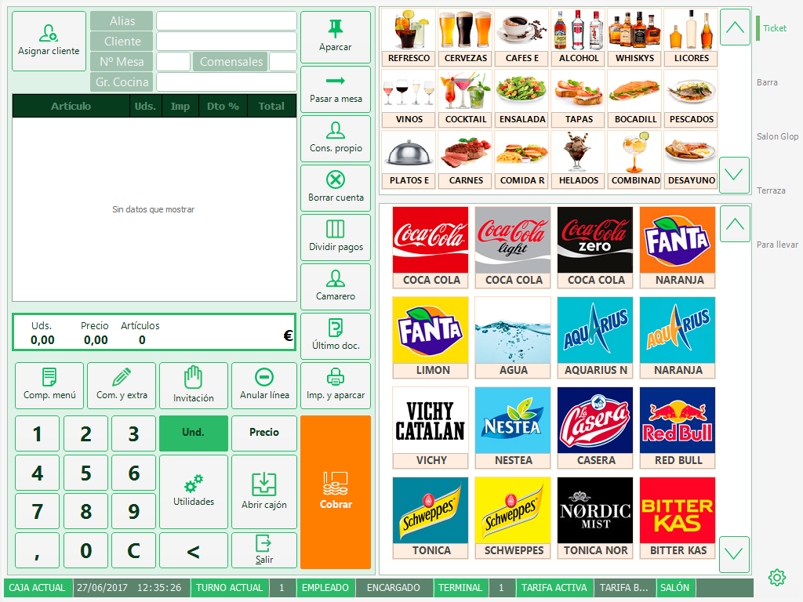

# MATERIAL PARA EVALUACIÓN (TRABAJO EN GRUPO - ENTREGA INDIVIDUAL)

Crea un proyecto con tres archivos: html, css y js.

* Enlaza los archivos CSS y JavaScript en el archivo HTML.
* Responde las siguientes preguntas implementando el código necesario
* Asegúrate de que el código sea funcional, esté bien estructurado y sea responsive.
* Comenta tu código para explicar lo que hace cada parte.

## INSTRUCCIONES 

* **Propuesta inicial**: Realiza un esquema de la estructura de tu POS. (Diagrama de flujo, mapa mental...).
* **Interfaz de menú**: Crea una interfaz en HTML que muestre un menú de productos de una cafetería (ej: café, té, pastel, sandwich, etc.). Cada producto debe tener una imagen, nombre, y un botón de "Agregar al carrito".
* **Diseño con CSS**:  Usa CSS para dar estilo al menú. Asegúrate de que los productos se muestren en una cuadrícula (grid) y que tengan un diseño atractivo (colores, bordes, sombras, etc.).
* **Funcionalidad del carrito**:  Implementa en JavaScript un carrito de compras que almacene los productos seleccionados. Muestra el carrito en una sección aparte en la interfaz.
* **Cantidad de productos**:  Modifica la interfaz para que el usuario pueda seleccionar la cantidad de cada producto antes de agregarlo al carrito. Asegúrate de que el precio total se calcule correctamente según la cantidad.
* **Calculadora**: Implementa un campo donde el usuario pueda utilizar la calculadora
* **Responsive Design**: Usa CSS para que la interfaz sea responsive. Asegúrate de que el menú y el carrito se vean bien en dispositivos móviles y tablets.
* **Confirmación de compra**:  Agrega un botón "Finalizar compra" que, al hacer clic, muestre un mensaje de confirmación con el total de la compra y vacíe el carrito.
* **Almacenamiento local**:  Usa localStorage para guardar el estado del carrito. Si el usuario recarga la página, el carrito debe mantenerse con los productos que había seleccionado.

## OPCIONAL
* Cuando el usuario haga clic en "Agregar al carrito", el producto debe agregarse al carrito y mostrarse en una lista. Además, actualiza el total de la compra.
* Agrega un botón "Eliminar" junto a cada producto en el carrito. Al hacer clic, el producto debe eliminarse del carrito y actualizar el total.

## EVALUACIÓN

* **Funcionalidad (50%):**  El código debe funcionar correctamente y cumplir con los requisitos de cada pregunta.
* **Estructura y limpieza (30%):**  El código debe estar bien organizado, con comentarios claros y un uso adecuado de indentación.
* **Diseño y experiencia de usuario (20%):**  La interfaz debe ser atractiva, accesible, intuitiva y responsive.

##ENTREGA

* Sube los archivos HTML, CSS y JavaScript u otros elementos según las especificaciones indicadas en clase (ZIP).

* Logotipos del vector de todas las marcas: https://worldvectorlogo.com/es
* Logotipos del mundo https://www.brandsoftheworld.com/

